## ACTIVIDAD MODELO TIENDA DE BARRIO
INFORMÁTICA I – GRUPO 2

- **Requerimiento:** Tienda de Barrio, que desea vender sus productos por internet, con los medios de pagos electrónicos (Débito por PSE, Crédito) y Contraentrega en efectivo.

## INTEGRANTES: 

- NATHALIA ANDREA SIERRA ORTEGA – COD. 20212099025.
- OSWALDO BORRERO NUÑEZ – COD. 20212099017.
- JHON EDISON GUZMAN ARIAS – COD. 20212099020.
- CARLOS ENRIQUE  ARENALES RINCÓN - COD. 20212099016.
 
## Roles: 

- Cliente.
- Administrador (Tendero).
- Domiciliario.
- Proveedor.

## Actividades Roles: 

1. Cliente: es el consumidor de los productos.
2. Administrador Plataforma: Se encarga de tener control del inventario de productos, actualización en la herramienta de ventas y la gestión del marketing y publicidad. adicionalmente, será el encargado de tomar el pedido y preparar el despacho de los productos y realizar reportes de ventas.
4. Domiciliario: Entrega del producto a los clientes.

## Historias de Usuario:

- **Cliente:** 
1. Como cliente quiero registrarme en la plataforma web, para realizar compras.
2. Como cliente quiero actualizar mis datos personales, para poder realizar compras
3. Como cliente quiero consultar el catalogo productos, para poder encontrar el producto que deseo comprar.
4. Como cliente quiero adicionar productos a la canasta de compras, para visualizar  todos mis productos y el precio total.
5. Como cliente quiero eliminar productos de la canasta de compras, para visualizar  todos mis productos y el precio total.
6. Como cliente quiero realizar el pago de la compra de uno o más productos por la plataforma web con débito, para mi consumo.
7. Como cliente quiero realizar el pago de la compra de uno o más productos por la plataforma web con crédito, para mi consumo.
8. Como cliente quiero realizar el pago de la compra utilizando el medio de pago efectivo, para mi consumo.
9. Como cliente quiero actualizar los datos de envío, para la recepción de mis productos.
10. Como cliente quiero realizar  el seguimiento de mi pedido, para conocer el tiempo de entrega.

- **Administrador:**
1. Como administrador de plataforma quiero consultar el inventario de productos, para abastecer la plataforma.
2. Como administrador de plataforma quiero actualizar el inventario disponible, para que los clientes puedan comprar.
3. Como administrador de la plataforma quiero realizar una promoción web, para que los clientes realicen sus compras.
4. Administrador de Ventas: 
5. Como administrador de ventas, quiero   consultar las notificaciones de pedidos pendientes, para poder hacer el despacho del pedido.
6. Como administrador de ventas quiero conocer el listado de pedidos despachados diarios, para conocer los ingresos diarios de la tienda.
7. Como administrador de ventas quiero conocer el listado de pedidos rechazados diarios, para conocer los ingresos diarios de la tienda.
8. Como administrador de ventas quiero alistar los pedidos pendientes, para entregar al domiciliario.
9. Como administrador de ventas quiero consultar el reporte de ventas por clientes al mes, para conocer el producto de mayor demanda al mes.
10. Como administrador de ventas quiero consultar el reporte de ventas por clientes al mes, para conocer cuál es el medio de pago más utilizado por los clientes.

- **Domiciliario:**
1. Como domiciliario quiero realizar la entrega de los pedidos, para completar el proceso de compra de los clientes.
2. Como domiciliario quiero recibir el pago en efectivo de los productos, para la entrega del pedido.
3. Como domiciliario quiero gestionar las devoluciones de pedidos, para que el administrador pueda ajustar el pedido.

## Vistas ARCHIMATE

- **Cooperación despacho de pedidos:** 

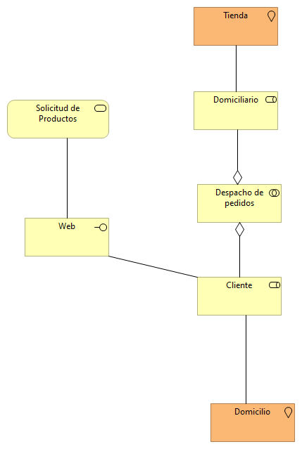 

- **Cooperación preparación de pedidos:** 

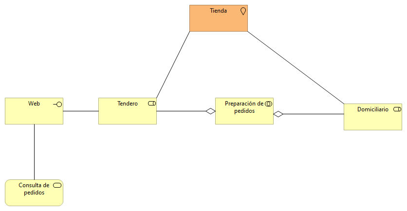 

- **Cooperación procesos de negocio:**

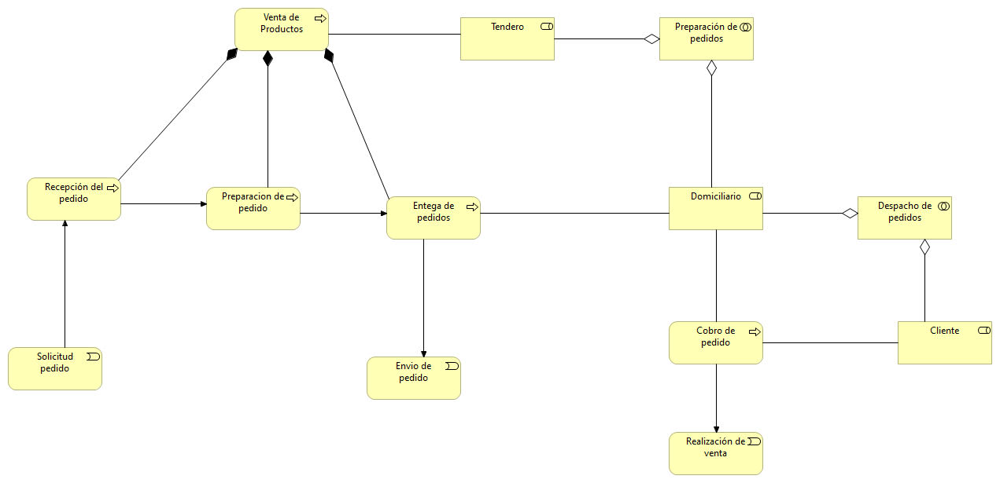 

- **Funciones de negocio:**

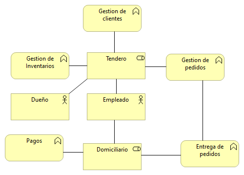

- **Organización:**
 
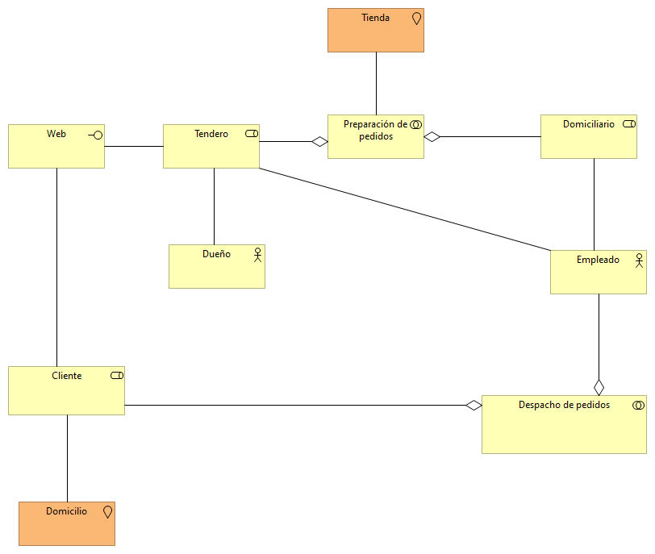

- **Por Capas:** 

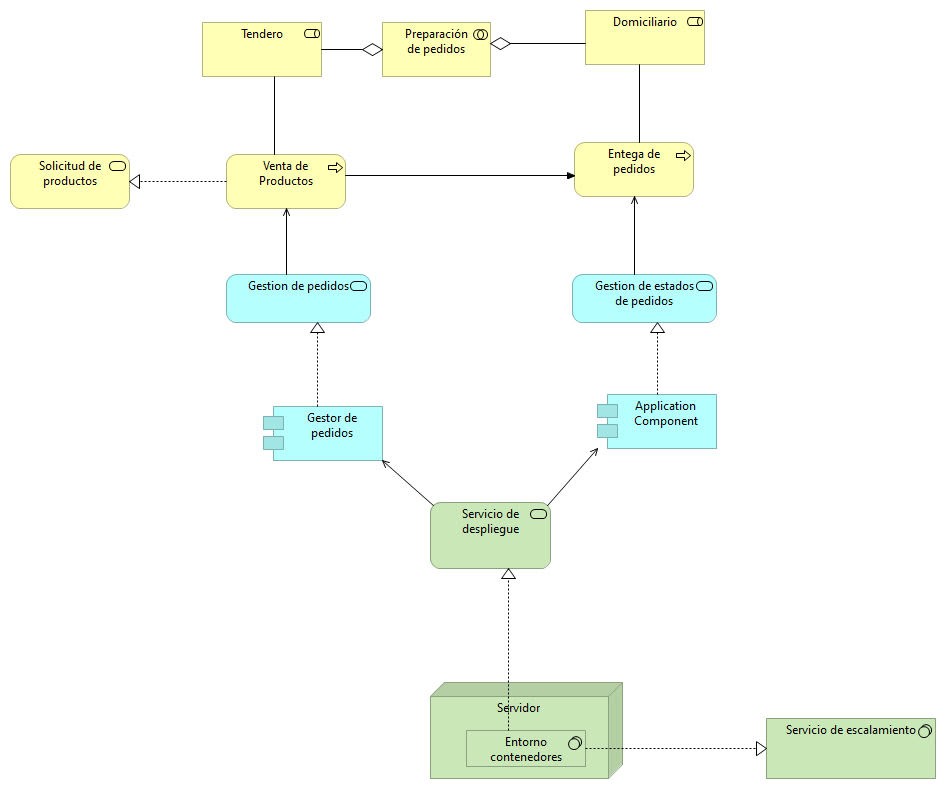

- **Procesos de negocio:**

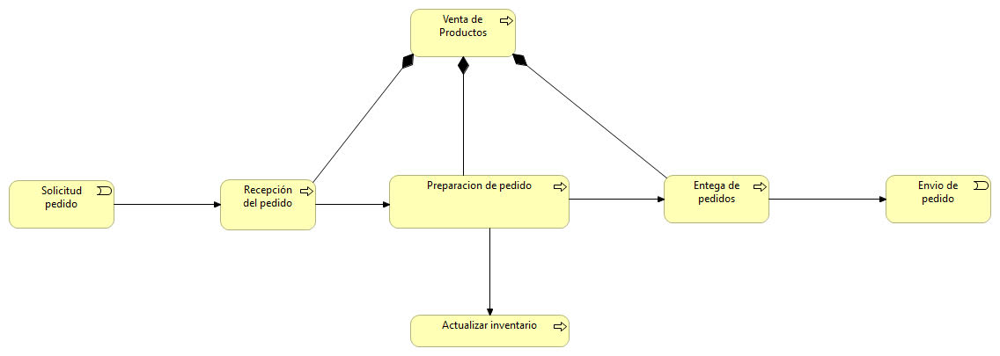

- **Producto:**

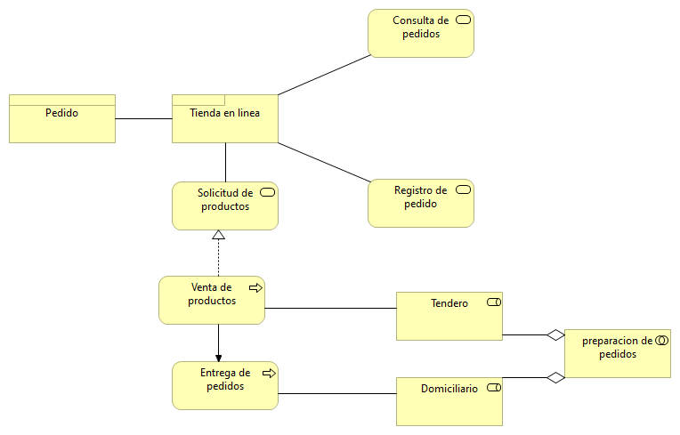

- **Comportamiento de aplicación:**

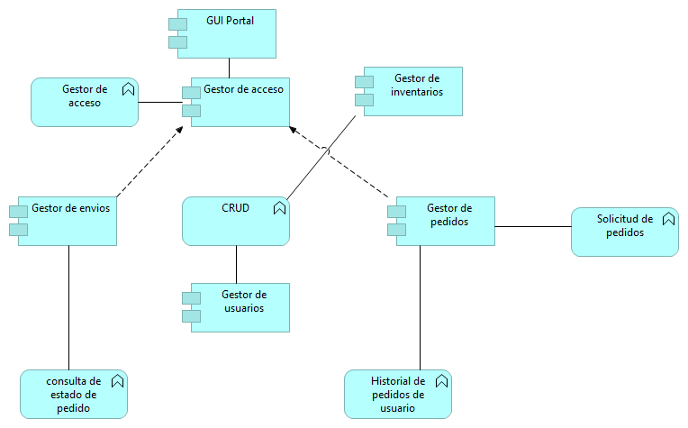

- **Cooperación de aplicaciones:**

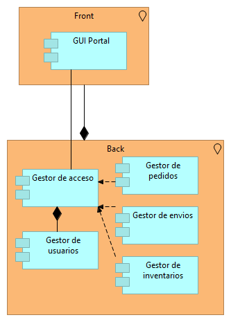

- **Estructura de aplicaciones:**

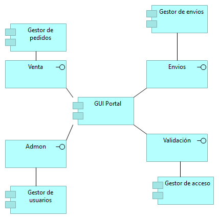

- **Uso de aplicación:**

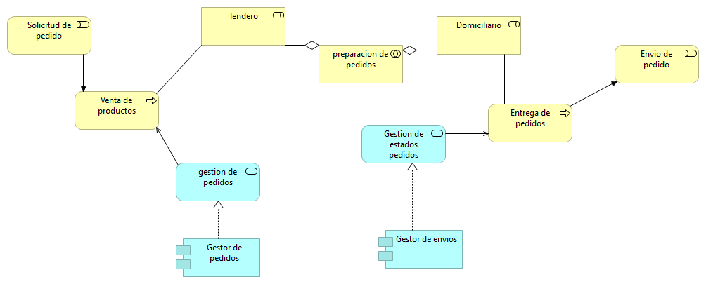

- **Infraestructura:**

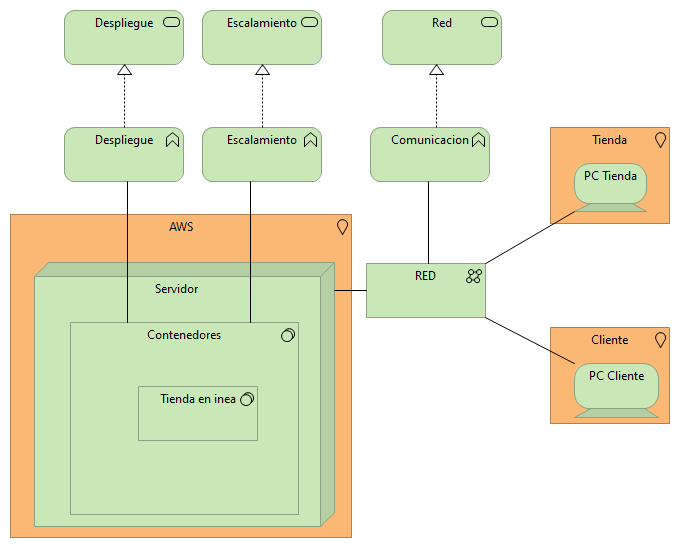

- **Uso de Infraestructura:**

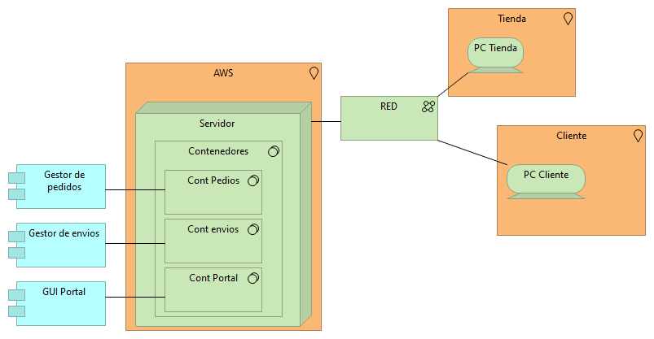

- **Estructura de Información:**

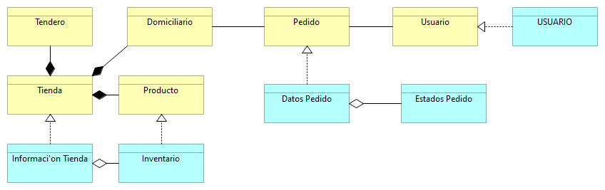

